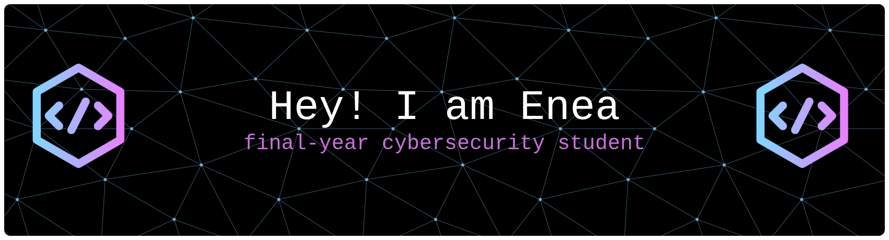

<!-- https://github.com/leviarista/github-profile-header-generator?tab=readme-ov-file per generaree immagine -->

# 💫 About Me:
final-year cybersecurity student

## 🌐 Socials:
  

# 💻 Programming Language:

 

# 💻 SW Development:

 

# 💻 OS:

# 💻 Others:
 
 

 
 
 

<!--
# 📊 GitHub Stats:
 
 

<picture>
  
</picture>
--->

### 📊 Le mie Statistiche GitHub

<!--  -->

## 🚀 Il mio GitHub Skyline 3D
Ecco il modello 3D delle mie contribuzioni. Puoi ruotarlo!

https://github.com/eneamanzi/eneamanzi/blob/main/eneamanzi-skyline.stl

